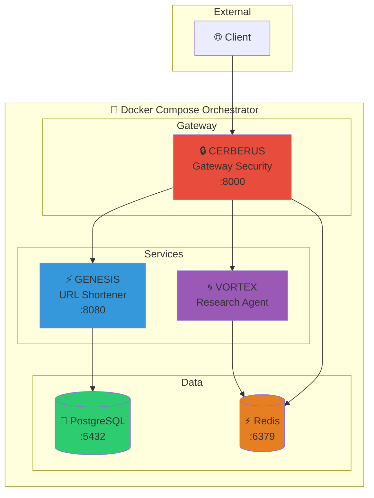

<div align="center">

```
  ██╗  ██╗██╗   ██╗██████╗ ███████╗██████╗ ██╗ ██████╗ ███╗   ██╗
  ██║  ██║╚██╗ ██╔╝██╔══██╗██╔════╝██╔══██╗██║██╔═══██╗████╗  ██║
  ███████║ ╚████╔╝ ██████╔╝█████╗  ██████╔╝██║██║   ██║██╔██╗ ██║
  ██╔══██║  ╚██╔╝  ██╔═══╝ ██╔══╝  ██╔══██╗██║██║   ██║██║╚██╗██║
  ██║  ██║   ██║   ██║     ███████╗██║  ██║██║╚██████╔╝██║ ╚████║
  ╚═╝  ╚═╝   ╚═╝   ╚═╝     ╚══════╝╚═╝  ╚═╝╚═╝ ╚═════╝ ╚═╝  ╚═══╝
```

### 🐳 System 12/300: Docker Compose Orchestrator

[](https://www.docker.com/)
[](https://docs.docker.com/compose/)
[](https://www.postgresql.org/)
[](https://redis.io/)
[](LICENSE)

**Unified Orchestration for the Titan Protocol Microservices**

---

[Quick Start](#-quick-start) • [Architecture](#-architecture) • [Services](#-service-details)

</div>

---

## 🚀 Quick Star

```bash
# Clone the repository
git clone https://github.com/DaviBonetto/HYPERION-L1-Docker-Orchestrator.git
cd HYPERION-L1-Docker-Orchestrator

# Configure environment
cp .env.example .env

# Start all services
docker compose up -d

# View logs
docker compose logs -f
```

---

## 🏗️ Architecture



---

## 📊 Service Details

| Service        | Port            | Technology | Purpose                          |
| -------------- | --------------- | ---------- | -------------------------------- |
| **Cerberus**   | 8000            | Rust       | API Gateway, Rate Limiting, Auth |
| **Genesis**    | 8080 (internal) | Rust       | URL Shortening Service           |
| **Vortex**     | - (internal)    | Python     | AI Research Agent                |
| **PostgreSQL** | 5432 (internal) | -          | Primary Database                 |
| **Redis**      | 6379 (internal) | -          | Cache & Rate Limiting            |

---

## 📁 Project Structure

```
HYPERION-L1-Docker-Orchestrator/
├── docker-compose.yml     # Main orchestration file
├── .env.example           # Environment template
├── Makefile               # Convenience commands
├── LICENSE                # MIT License
└── README.md
```

---

## 🔒 Security Notes

- Only **Cerberus** exposes ports to the host
- All internal services communicate via `titan_network`
- Redis requires password authentication
- Resource limits prevent runaway containers

---

## 🛠️ Makefile Commands

```bash
make help      # Show available commands
make up        # Start all services
make down      # Stop all services
make logs      # Follow service logs
make build     # Rebuild images
make clean     # Remove everything
```

---

## 🔗 Titan Protocol Initiative

| System     | Name         | Technology  |
| ---------- | ------------ | ----------- |
| 08/300     | HERMES       | Go + gRPC   |
| 09/300     | CERBERUS     | Rust + Axum |
| **12/300** | **HYPERION** | **Docker**  |

---

<div align="center">

**Built with 🐳 Docker + ⚡ Compose by [Davi Bonetto](https://github.com/DaviBonetto)**

_Part of the Titan Protocol Initiative_

</div>
