# 🌐 HYPERION - Docker Orchestrator

[](https://www.docker.com/)
[](https://docs.docker.com/compose/)
[](https://www.rust-lang.org/)
[](https://www.python.org/)
[](https://www.postgresql.org/)
[](https://redis.io/)

> **Titan Protocol System 12/300**  
> Unified Docker orchestration for the Titan Protocol microservices ecosystem.

## 📋 Overview

HYPERION is the central Docker Compose orchestrator that coordinates all Titan Protocol services:

- **GENESIS** - High-Performance URL Shortener (Rust, L1)
- **VORTEX** - Research Agent with LangGraph (Python, L4)
- **CERBERUS** - Gateway Security Service (Rust, L2)

## 🚀 Quick Start

```bash
# Clone the repository
git clone https://github.com/DaviBonetto/HYPERION-L1-Docker-Orchestrator.git
cd HYPERION-L1-Docker-Orchestrator

# Configure environment
cp .env.example .env

# Start all services
docker compose up -d

# View logs
docker compose logs -f
```

## 📁 Project Structure

```
HYPERION-L1-Docker-Orchestrator/
├── docker-compose.yml     # Main orchestration file
├── .env.example           # Environment template
├── Makefile               # Convenience commands
├── LICENSE                # MIT License
├── .gitignore
└── README.md
```

## 🏗️ Architecture

```mermaid
flowchart TB
    subgraph External
        Client[🌐 Client]
    end

    subgraph HYPERION["🐳 Docker Compose Orchestrator"]
        subgraph Gateway
            Cerberus[🔒 CERBERUS<br/>Gateway Security<br/>:8000]
        end

        subgraph Services
            Genesis[⚡ GENESIS<br/>URL Shortener<br/>:8080]
            Vortex[🌀 VORTEX<br/>Research Agent]
        end

        subgraph Data
            Postgres[(🐘 PostgreSQL<br/>:5432)]
            Redis[(⚡ Redis<br/>:6379)]
        end
    end

    Client --> Cerberus
    Cerberus --> Genesis
    Cerberus --> Vortex
    Genesis --> Postgres
    Vortex --> Redis
    Cerberus --> Redis

    style Cerberus fill:#e74c3c
    style Genesis fill:#3498db
    style Vortex fill:#9b59b6
    style Postgres fill:#2ecc71
    style Redis fill:#e67e22
```



## 📊 Service Details

| Service        | Port            | Technology | Purpose                          |
| -------------- | --------------- | ---------- | -------------------------------- |
| **Cerberus**   | 8000            | Rust       | API Gateway, Rate Limiting, Auth |
| **Genesis**    | 8080 (internal) | Rust       | URL Shortening Service           |
| **Vortex**     | - (internal)    | Python     | AI Research Agent                |
| **PostgreSQL** | 5432 (internal) | -          | Primary Database                 |
| **Redis**      | 6379 (internal) | -          | Cache & Rate Limiting            |

## 🔒 Security Notes

- Only **Cerberus** exposes ports to the host
- All internal services communicate via `titan_network`
- Redis requires password authentication
- Resource limits prevent runaway containers

## 🛠️ Makefile Commands

```bash
make help      # Show available commands
make up        # Start all services
make down      # Stop all services
make logs      # Follow service logs
make build     # Rebuild images
make clean     # Remove everything
make restart   # Restart all services
```

## 📜 License

MIT License - see [LICENSE](LICENSE) for details.

---

<p align="center">
  <strong>🔱 Titan Protocol</strong><br>
  <em>System 12/300 - HYPERION Docker Orchestrator</em>
</p>
